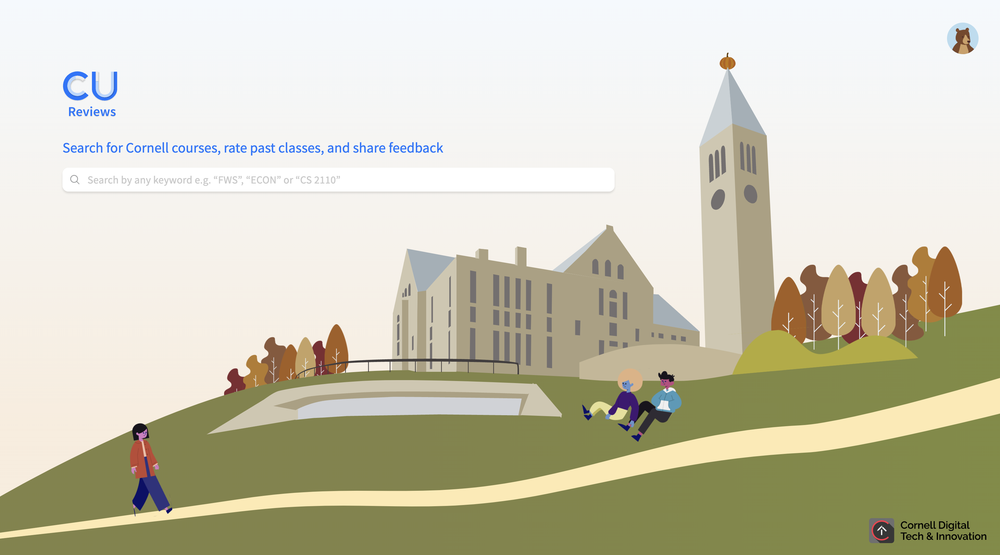
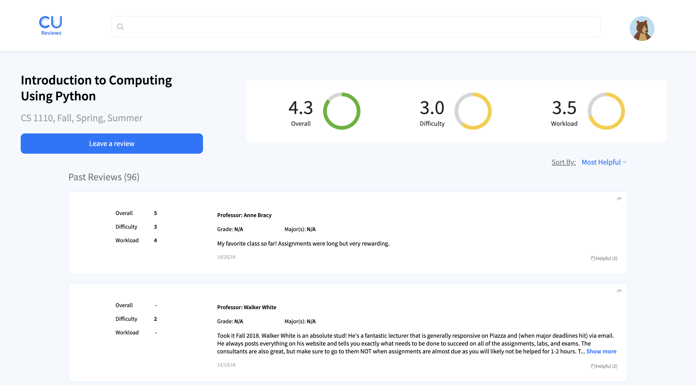
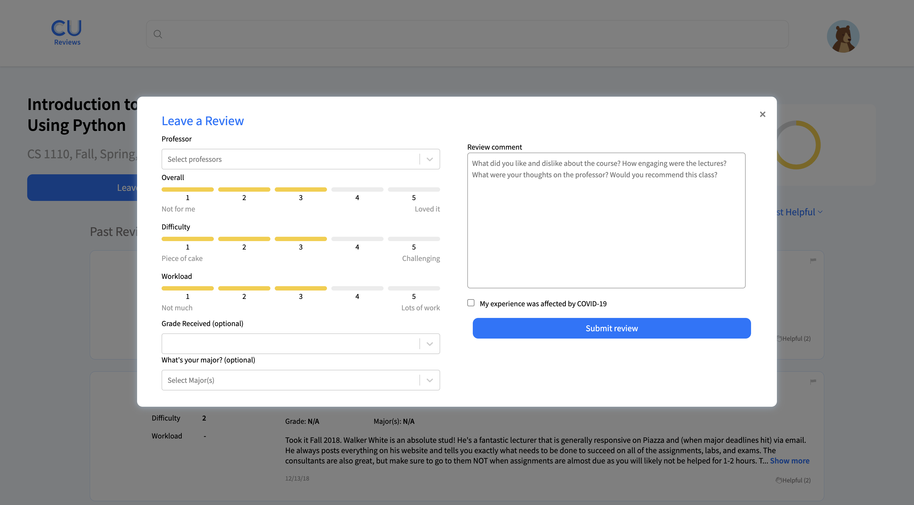

# CU Reviews

## Contents

- [CU Reviews](#cu-reviews)
  - [Contents](#contents)
  - [About](#about)
  - [Quick Start](#quick-start)
  - [Dependencies \& Libraries](#dependencies--libraries)
  - [Screenshots](#screenshots)
  - [Contributors](#contributors)
    - [Spring 2025](#spring-2025)
    - [Fall 2024](#fall-2024)
    - [Past semesters](#past-semesters)

## About

A web app for Cornell students to read and write reviews for Cornell classes, allowing a common platform for students to get advice and suggestions for picking classes. In other words, a _rate my classes_, but for Cornell University.

## Quick Start

1. Clone the code:

   ```bash
   git clone https://github.com/cornell-dti/cureviews.git
   ```

2. Add the MongoDB connection inside `server/.env`:

   ```txt
      MONGODB_URL=see-notion-page
      OPENAI_API_KEY=see-notion-page
   ```

   _This would be only the staging DB, only Leads have access to production._

3. Now that you have the database configured, make sure you have [Yarn](https://classic.yarnpkg.com/) installed.
4. Start the local environments.

   ```bash
   # At Root (./cureviews/):
   yarn # installs dependencies in package.json & lock file
   ```

   ```bash
   yarn server # starts server
   ```

   ```bash
   yarn client # starts client
   ```

You can access the app at [http://localhost:3000].

If you need features which use admin access, you need to create an entry in the `students` collection which has you flagged as an admin user. We should have done this when you joined the team.

_Last updated **09/13/2023**_.

**You will probably use the address of the staging server.** If, for some reason you want to have a local db (E.g. you're making some changes to the db structure, and don't want to accidently trash the staging db), the following works:

<details><summary>Running using local mongodb server</summary>
<p>

Option 1:

Previously, you would start a server like so:

```bash
MONGODB_URL='mongodb://foo' yarn workspace server start
```

There is also something called "fallback mode", which you can trigger by starting the server with the ALLOW_LOCAL env variable set to 1, and **without** setting MONGODB_URL. Fallback mode automatically configures a blank mongodb for use in the application, and then scrapes some data from Cornell's endpoint for you to test. There will not be any reviews by default.

```bash
ALLOW_LOCAL=1 yarn workspace server start
```

Option 2:

<details><summary>If you really, really do want to use a local Mongo instance using mongod (not recommended), this might work: </summary>

You need the mongodb database tools and server installed. They are available [here](https://docs.mongodb.com/database-tools/) and [here](https://www.mongodb.com/download-center/community). If, for some reason, you want to use the tools on a linux box, you will probably have to build them from source [here](https://github.com/mongodb/mongo-tools).

```bash
mkdir mongo # create a directory for mongo to dump its files in
mongod --dbpath mongo/ --port 3001 # launch the mongo server on localhost:3001
```

Set your `MONGODB_URL` to `mongodb://localhost:3001`

You will probably want to restore some collections from a bson, in which case you should, in a new terminal:

```bash
mongorestore -h 127.0.0.1 --port 3001 -d test /path/to/your/bson.bson --drop
```

You will probably need to run this for the `classes`, `subjects` and `reviews` collections (Perhaps also `students`). Ask a team member for the bsons if you need them. If this errors, it might be because the `-d test` specifies the wrong database name (`test`), in which case you should figure out your db name, and replace `-d test` with `-d dbname`. Note that it **won't** error on the command, the only evidence of an error is that none of collections will be show up on the site (i.e. no classes visible).

</details>

</p>
</details>

## Dependencies & Libraries

- **[Node.js](https://nodejs.org/en/about/)** v10 - **Node.js provides the basis for our server. It handles external connects and gives us access to an vast array of useful packages via Node Package Manager (NPM)**
- **[Express](https://expressjs.com/)** v4.17.1 - **The package for running the web server.**
- **[React](https://reactjs.org/)** v16.13.1 - **We use React to help us create a component-based site. Using components allow us to re-use code more efficiently and modify their implementation more quickly**

## Screenshots





## Contributors
### Spring 2025

- **Andrew Qian** - Technical Product Manager
- **Helen Lei** - Developer
- **Matthew Kim** - Developer
- **Cynthia Lan** - Product Marketing Manager

### Fall 2024

- **Megan Yap** - Product Manager
- **Will Zhang** - Technical Product Manager
- **Erica Lee** - Designer
- **Renee Du** - Designer
- **Helen Lei** - Developer
- **Jacqueline Cai** - Developer
- **Andrew Qian** - Developer
- **Matthew Kim** - Developer
- **Jaeyoung Lee** - Product Marketing Manager

### Past semesters

- **Jonathan Kim** - Product Manager (FA23, SP24)
- **Tina Ou** - Product Manager (2021-2023)
- **Angela Chen** - Product Manager (2020)
- **Adam Masters** - Product Manager (2018-2019)
- **Jessica Prague** - Designer (2017), Product Manager (2018)
- **Brooke Docherty** - Product Manager (2017)
- **Divyansha Sehgal** - Product Manager (2017)
- **Maywa Padungrat** - Designer (2021), Associate Product Manager (2022)
- **Andrea Thia** - Designer (FA23, SP24)
- **Valerie Wong** - Designer (SP24)
- **Larrisa Chen** - Designer (2021)
- **Erin Chen** - Designer (2020)
- **Flora Liu** - Designer (2020)
- **Erin Chen** - Designer (2018)
- **Jesse Mansoor** - Designer (2017-2018)
- **Michelle Li** - Developer (2021), Technical Product Manager (2022), Developer Advisor (FA23)
- **Akash Aryal** - Developer (2019-2020), Technical Product Manager (2021)
- **Julian Londono** - Developer (2017), Product Manager (2018), Technical Product Manager (2019-2020)
- **Luis Hoderlein** - Developer (2019), Technical Product Manager (2020)
- **Julie Jeong** - Developer (2020-2022), Developer Advisor (SP24)
- **Harrison Chin** - Developer (FA23)
- **Samuel Yeboah** - Developer (FA23)
- **Jack Farley** - Developer (2021-2023)
- **Ankit Lakkapragada** - Developer (2021-2023)
- **Andrew Gao** - Developer (2021)
- **Dray Farley** - Developer (2018-2020)
- **Tanay Menezes** - Developer (2020)
- **Jessica Chen** - Developer (2017-2019)
- **Bryan Graeser** - Developer (2018)
- **Vinisha Mittal** - Developer (2017
- **Miranda Yu** - Product Marketing Manager (2022)

  

We are a team within **Cornell Digital Tech Innovation**. For more information, see our website [here](https://cornelldti.org/).

